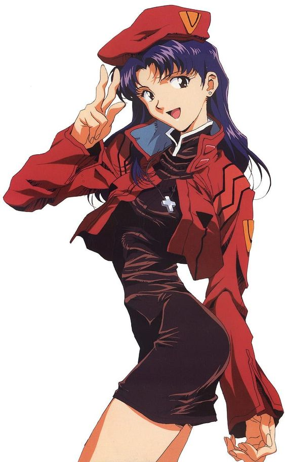
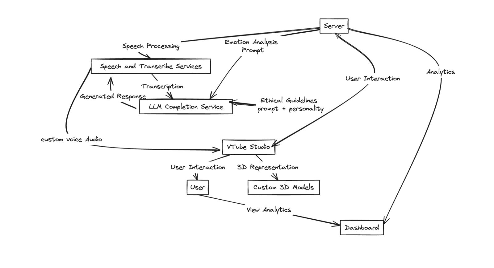

<p align="center">
  
</p>


## How it works:


## Installation:
 1. Install Python 3.10.5 if you don't already have 
 2. Clone the repository by running `git clone https://github.com/KMJ-007/misato-ai-companion`
 3. Install the required Python packages by running `pip install -r requirements.txt` in the project directory.
 4. Create `.env` file inside the project directory and enter your API keys
    <details>
      <summary> .env template</summary>
      
      ```shell
      OPENAI_API_KEY='YOUR_OPEN_AI_KEY'
      ELEVENLABS_API_KEY='YOUR_ELEVENLABS_KEY'
      ```
    </details>
    
    5. run the project using
    ```bash
    python main.py
    ```
> you can adjust the tts and stt and chat completion model and service in init function


- if you want to connect with the vtube kind of interface and want to run it together, complete connection and sync working is pending

    install the vbt studio from steam

run the interface file
```bash
python animeInterfaceVTS.py
```

# ps:
code is written in little rush because of the hackathon's little time, if you find any crappy or code which don't make any kind of sense, i think i can explain, contact me!, will document and fix it in future 